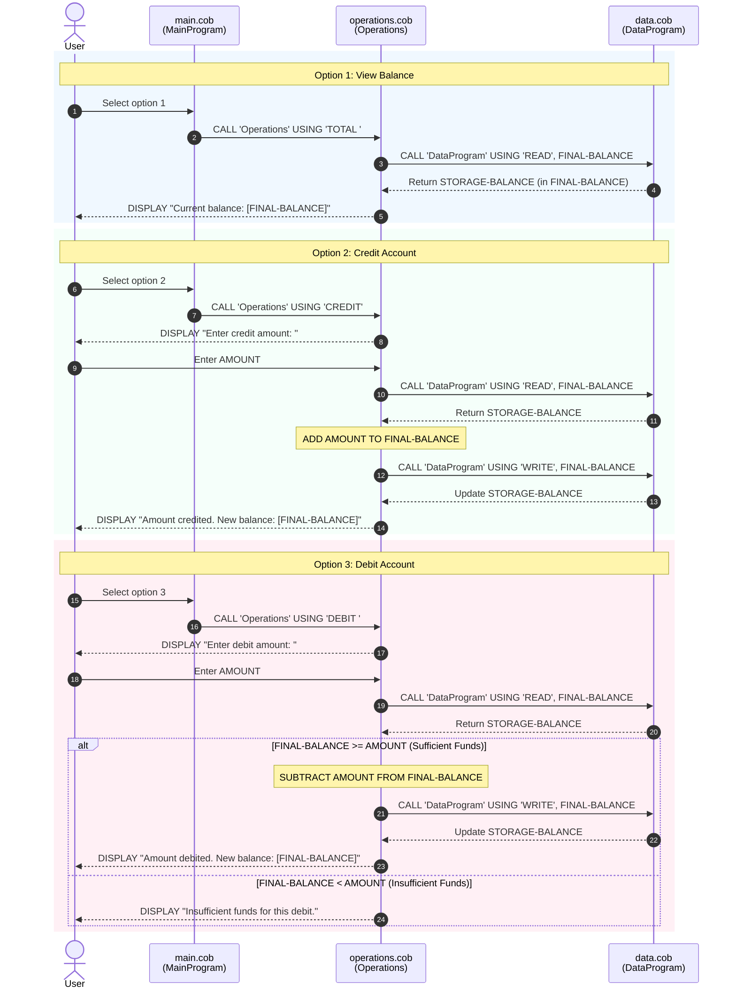

# Student Account Management System (COBOL Core)

This directory contains the documentation for the legacy COBOL-based Account Management System, which handles student account balances, credits, and debits.

---

## System Overview

The system consists of three interconnected COBOL programs working together to provide a command-line interface (CLI) for managing student account balances. The architecture separates the user interface, business logic, and data persistence/storage into separate modules.

```
       +-----------------------+
       |       main.cob        |  (User Interface & Menu Loop)
       |    (MainProgram)      |
       +-----------+-----------+
                   |
                   | CALL 'Operations'
                   v
       +-----------------------+
       |    operations.cob     |  (Business Logic & Validation)
       |     (Operations)      |
       +-----------+-----------+
                   |
                   | CALL 'DataProgram' (READ / WRITE)
                   v
       +-----------------------+
       |       data.cob        |  (In-Memory Data Storage Simulator)
       |     (DataProgram)     |
       +-----------------------+
```

---

## File Documentation

### 1. `src/cobol/main.cob` (Program ID: `MainProgram`)
* **Purpose**: Acts as the main entry point and provides a text-based User Interface (CLI) menu for the application.
* **Key Functions & Control Flow**:
  * **Menu Loop (`MAIN-LOGIC`)**: Displays a command-line menu and loops continuously until the user explicitly selects option 4 (Exit).
  * **User Choices**:
    * `1` - View Balance: Calls `Operations` program with the parameter `'TOTAL '`.
    * `2` - Credit Account: Calls `Operations` program with the parameter `'CREDIT'`.
    * `3` - Debit Account: Calls `Operations` program with the parameter `'DEBIT '`.
    * `4` - Exit: Sets `CONTINUE-FLAG` to `'NO'` to break the loop and terminates execution.
  * **Input Validation**: Validates user selection. Any inputs other than `1-4` output `"Invalid choice, please select 1-4."` and present the menu again.

---

### 2. `src/cobol/operations.cob` (Program ID: `Operations`)
* **Purpose**: Executes the core business operations (viewing, crediting, and debiting) based on the action requested by `MainProgram`.
* **Key Functions & Control Flow**:
  * **Linkage Interface**: Expects a single parameter `PASSED-OPERATION` (mapped to `OPERATION-TYPE PIC X(6)`).
  * **Operations**:
    * **`TOTAL `**:
      1. Calls `DataProgram` with `'READ'` to fetch the current balance.
      2. Displays the balance to the user.
    * **`CREDIT`**:
      1. Prompts the user to input a credit amount (`ACCEPT AMOUNT`).
      2. Calls `DataProgram` with `'READ'` to retrieve the current balance.
      3. Adds the entered amount to the current balance.
      4. Calls `DataProgram` with `'WRITE'` to persist the new balance.
      5. Displays the newly updated balance.
    * **`DEBIT `**:
      1. Prompts the user to input a debit amount (`ACCEPT AMOUNT`).
      2. Calls `DataProgram` with `'READ'` to retrieve the current balance.
      3. Performs an **Insufficient Funds Check**: checks if the current balance is greater than or equal to the requested debit amount.
      4. If the check passes: Subtracts the amount, calls `DataProgram` with `'WRITE'` to save the new balance, and displays the updated balance.
      5. If the check fails: Displays `"Insufficient funds for this debit."` and aborts the subtraction/write.

---

### 3. `src/cobol/data.cob` (Program ID: `DataProgram`)
* **Purpose**: Acts as the data persistence/access layer. Since there is no physical file-based or SQL database, this program simulates data storage in-memory using COBOL working storage.
* **Key Functions & Control Flow**:
  * **Working Storage State**:
    * Maintains a persistent (for the duration of program execution) variable `STORAGE-BALANCE` with an initial value of `1000.00`.
  * **Linkage Interface**: Expects two parameters:
    1. `PASSED-OPERATION` (`PIC X(6)`): The operation to perform (`'READ'` or `'WRITE'`).
    2. `BALANCE` (`PIC 9(6)V99`): The balance variable to retrieve or update.
  * **Operations**:
    * **`READ`**: Copies the current `STORAGE-BALANCE` value into the passed `BALANCE` variable.
    * **`WRITE`**: Overwrites the internal `STORAGE-BALANCE` with the new value from the passed `BALANCE` variable.

---

## Business Rules for Student Accounts

1. **Initial / Starting Balance**:
   * Every student account is initialized with a default balance of **`$1000.00`** upon system startup (defined in `data.cob` as the starting value of `STORAGE-BALANCE`).

2. **Numeric Representation & Constraints**:
   * All balance and transaction amounts are represented using the COBOL picture clause `PIC 9(6)V99`.
   * **Decimal Precision**: Fixed-point with exactly two decimal places (`V99`), ensuring precise currency calculations and preventing floating-point rounding issues.
   * **Upper Limit (Maximum Capacity)**: The maximum value that can be held or represented in this format is **`$999,999.99`**. Any credit operation that causes the balance to exceed this limit will result in numeric overflow behavior (standard COBOL truncation or wrapping) since there is no upper-bound overflow check implemented.

3. **Debit Validation / Insufficient Funds Rule**:
   * An account **cannot** go into a negative balance.
   * Before any debit/withdrawal is performed, the system validates that:
     $$\text{Current Balance} \ge \text{Requested Debit Amount}$$
   * If this condition is met, the debit is approved and processed.
   * If the requested amount exceeds the current balance, the transaction is rejected, no changes are written, and the message `"Insufficient funds for this debit."` is displayed.

4. **Action Trailing Spaces**:
   * Parameters passed between the programs are fixed-length strings (`PIC X(6)`). Operations like `'TOTAL '` and `'DEBIT '` must include trailing spaces to match the 6-character expectation, whereas `'CREDIT'` fits perfectly.

---

## Data Flow & Sequence Diagram

The following sequence diagram illustrates the user interaction and inter-program data flows for all three operations: **View Balance**, **Credit**, and **Debit** (detailing both success and insufficient funds error paths).



